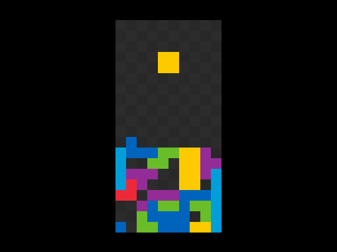

# Console Tetris for Linux [Under development]

*Basic idea taken from [maxoverride's repo](https://github.com/maxoverride/tetris_console) (which runs on windows at the time of fork).*

This project is a remake of the classic game of Tetris for the linux console.



### Tasks

- [x] ~~Refactor for Linux~~
	- [x] ~~Discard Windows Functions~~
	- [x] ~~Refactor rendering~~
	- [x] ~~Refactor key movements (ncurses used here)~~
	- [x] ~~Refactor line clearing~~
	- [x] ~~Refactor Game over functions~~
- [ ] Add Scoreboard
- [ ] Add T-spins
- [ ] Add next block window

### Build

- Clone this repository
- Open the directory in your terminal
- Do:
	```
	make clean && make
	```

### Run

- Launch tetris_runner executable:
	```
	./tetris_runner
	```

